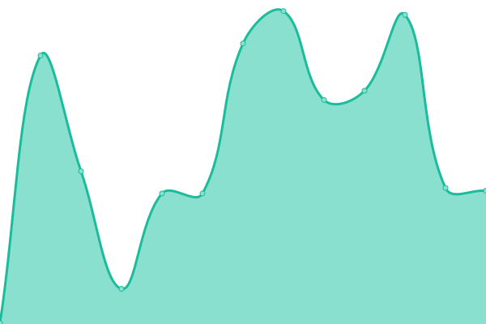
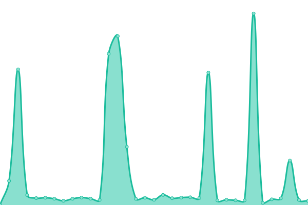
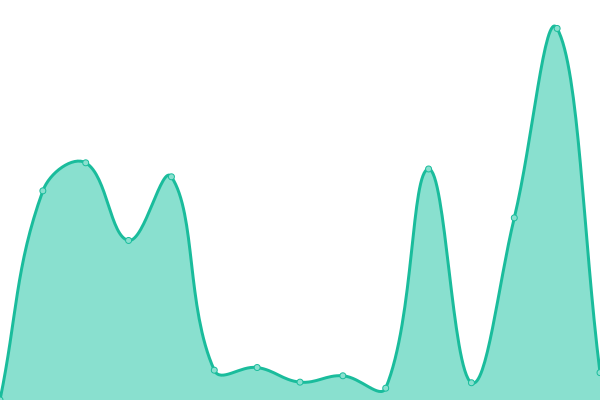
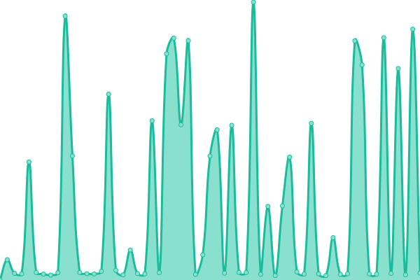

# [📈 Live Status](https://Linerly.github.io/status): <!--live status--> **🟧 Partial outage**

This repository contains the open-source uptime monitor and status page for [Linerly](linerly.github.io), powered by [Upptime](https://github.com/upptime/upptime).

With [Upptime](https://upptime.js.org), you can get your own unlimited and free uptime monitor and status page, powered entirely by a GitHub repository. It uses [Issues](https://github.com/Linerly/status/issues) as incident reports, [Actions](https://github.com/Linerly/status/actions) as uptime monitors, and [Pages](https://Linerly.github.io/status) for the status page.

<!--start: status pages-->
<!-- This summary is generated by Upptime (https://github.com/upptime/upptime) -->
<!-- Do not edit this manually, your changes will be overwritten -->
<!-- prettier-ignore -->
| URL | Status | History | Response Time | Uptime |
| --- | ------ | ------- | ------------- | ------ |
|  [Website](https://linerly.tk) | 🟩 Up | [website.yml](https://github.com/Linerly/status/commits/HEAD/history/website.yml) | 

 590ms
     
 | 

<a href="https://Linerly.github.io/status/history/website">100.00%</a>
    

|  [Blog](https://linerly.tk/blog) | 🟩 Up | [blog.yml](https://github.com/Linerly/status/commits/HEAD/history/blog.yml) | 

 88ms
     
 | 

<a href="https://Linerly.github.io/status/history/blog">100.00%</a>
    

|  [SearXNG](https://searxng.linerly.tk) | 🟩 Up | [sear-xng.yml](https://github.com/Linerly/status/commits/HEAD/history/sear-xng.yml) | 

 3442ms
     
 | 

<a href="https://Linerly.github.io/status/history/sear-xng">91.63%</a>
    

|  [MortyProxy](https://proxy.linerly.tk) | 🟩 Up | [morty-proxy.yml](https://github.com/Linerly/status/commits/HEAD/history/morty-proxy.yml) | 

 1089ms
     
 | 

<a href="https://Linerly.github.io/status/history/morty-proxy">98.31%</a>
    

|  [LinerlyBot (Discord)](https://linerlybot-discord.linerly.tk) | 🟥 Down | [linerly-bot-discord.yml](https://github.com/Linerly/status/commits/HEAD/history/linerly-bot-discord.yml) | 

 4624ms
     
 | 

<a href="https://Linerly.github.io/status/history/linerly-bot-discord">0.00%</a>
    

|  [Apkes](https://apkes.linerly.tk) | 🟩 Up | [apkes.yml](https://github.com/Linerly/status/commits/HEAD/history/apkes.yml) | 

 2205ms
     
 | 

<a href="https://Linerly.github.io/status/history/apkes">95.45%</a>
    

<!--end: status pages-->

[**Visit my status website →**](https://Linerly.github.io/status)

## 📄 License

- Powered by: [Upptime](https://github.com/upptime/upptime)
- Code: [MIT](./LICENSE) © [Linerly](https://linerly.github.io)
- Data in the `./history` directory: [Open Database License](https://opendatacommons.org/licenses/odbl/1-0/)
