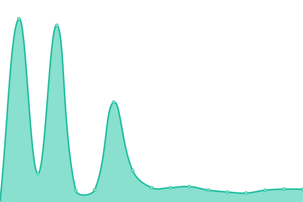
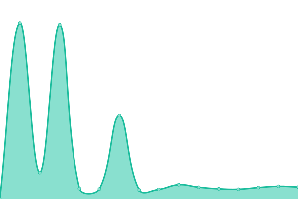
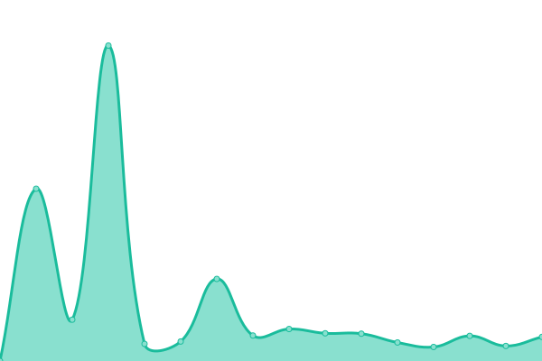
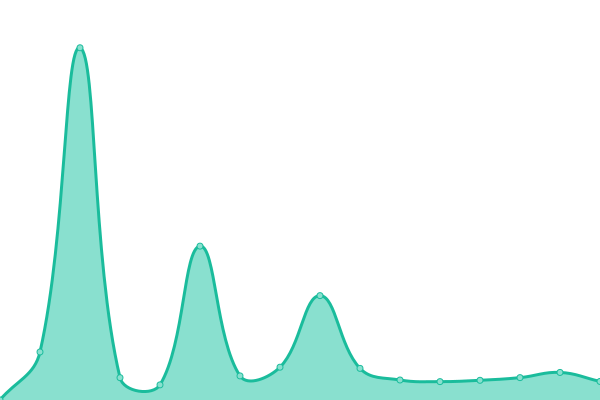

# [📈 Live Status](https://Linerly.github.io/status): <!--live status--> **🟩 All systems operational**

This repository contains the open-source uptime monitor and status page for [Linerly](linerly.github.io), powered by [Upptime](https://github.com/upptime/upptime).

With [Upptime](https://upptime.js.org), you can get your own unlimited and free uptime monitor and status page, powered entirely by a GitHub repository. It uses [Issues](https://github.com/Linerly/status/issues) as incident reports, [Actions](https://github.com/Linerly/status/actions) as uptime monitors, and [Pages](https://Linerly.github.io/status) for the status page.

<!--start: status pages-->
<!-- This summary is generated by Upptime (https://github.com/upptime/upptime) -->
<!-- Do not edit this manually, your changes will be overwritten -->
<!-- prettier-ignore -->
| URL | Status | History | Response Time | Uptime |
| --- | ------ | ------- | ------------- | ------ |
|  [Website](https://linerly.xyz/en) | 🟩 Up | [website.yml](https://github.com/Linerly/status/commits/HEAD/history/website.yml) | 

 1575ms
     
 | 

<a href="https://status.linerly.xyz/history/website">94.37%</a>
    

|  [Apkes](https://apkes.linerly.xyz) | 🟩 Up | [apkes.yml](https://github.com/Linerly/status/commits/HEAD/history/apkes.yml) | 

 1936ms
     
 | 

<a href="https://status.linerly.xyz/history/apkes">93.63%</a>
    

|  [Geora](https://geora.linerly.xyz) | 🟩 Up | [geora.yml](https://github.com/Linerly/status/commits/HEAD/history/geora.yml) | 

 1938ms
     
 | 

<a href="https://status.linerly.xyz/history/geora">93.64%</a>
    

|  [Pegiatan](https://pegiatan.linerly.xyz) | 🟩 Up | [pegiatan.yml](https://github.com/Linerly/status/commits/HEAD/history/pegiatan.yml) | 

 2151ms
     
 | 

<a href="https://status.linerly.xyz/history/pegiatan">94.50%</a>
    

|  [EcoTrek](https://ecotrek.linerly.xyz) | 🟩 Up | [eco-trek.yml](https://github.com/Linerly/status/commits/HEAD/history/eco-trek.yml) | 

 5180ms
     
 | 

<a href="https://status.linerly.xyz/history/eco-trek">95.10%</a>
    

|  [EcoCalc](https://ecocalc.linerly.xyz) | 🟩 Up | [eco-calc.yml](https://github.com/Linerly/status/commits/HEAD/history/eco-calc.yml) | 

 3906ms
     
 | 

<a href="https://status.linerly.xyz/history/eco-calc">95.11%</a>
    

|  [Nontrinsic](https://nontrinsic.linerly.xyz) | 🟩 Up | [nontrinsic.yml](https://github.com/Linerly/status/commits/HEAD/history/nontrinsic.yml) | 

 371ms
     
 | 

<a href="https://status.linerly.xyz/history/nontrinsic">99.41%</a>
    

|  [Immich](https://media.linerly.xyz) | 🟩 Up | [immich.yml](https://github.com/Linerly/status/commits/HEAD/history/immich.yml) | 

 818ms
     
 | 

<a href="https://status.linerly.xyz/history/immich">100.00%</a>
    

|  [Home Assistant](https://home.linerly.xyz) | 🟩 Up | [home-assistant.yml](https://github.com/Linerly/status/commits/HEAD/history/home-assistant.yml) | 

 831ms
     
 | 

<a href="https://status.linerly.xyz/history/home-assistant">100.00%</a>
    

| <img alt="" src="data:image/png;base64,iVBORw0KGgoAAAANSUhEUgAAAEAAAABACAYAAACqaXHeAAANm0lEQVR4XuWWeVCU+ZnHO5utbCq7NdlNJbuzlczEidEZZ52diTKjznggqMgplyCH3PfVgM19NfTFfQqKCirKDS2XyH2KaINyI9CNTlUqlWQrm81uzR7Bcb77vO1AkJ+ttgOmUv3Hp8puu9/f8/3wfp+3eSkLn0OHUfBSFh5Ch1HwRAsPoMNwAhahw3ACVNBhFDzxghI6DCdgAToMCVDOQ4dR8CTKOegwnID7+LOwMAvx/AxE96cgmptW/5v5zMaj4EmVs1iN5DUgmptC4pgCEX2dCBioQGB3DSIHepA0MUoippnPbyCcgBm8LiTzUxBSyIjeDrhVnIXJuCv0H22G/v9tg/mwP7wqLyJqsBvJU3fVn137/Q2AEzCNjUayMIWU6XuIGeqFb3UZzHuCof/Fdujj7ac4+O96sLoeiQB5FeLuDEA0O6b+7trrrSMKnkw5hY1CujAJ8f0xxI8MIrixFrYNCTD4zWdM8LUYfn4YJ2qkCG1tQOLdW3SNcRr262uuL5yASWwEkrkxCMduIby9Cc6VGTi8YA79r9iwGnm0CUbj9nArL0BETyuSJ25DOj/OnPMN4QRMYD2Rzo8hZfIOovrb4Mn1XOEC/T9uZgO+LP9N+6HPDz5VpYi52QXRtILuLE4Ee/YroOClKsexHsgWxiCeUSBuuBv+tWWw7OBD/z8/ZAO9Igf/bTdsmmIQ3FCJBEUfxLOj6jPVZ786nADuIt+AhXuQ3h9B0mg/QltqYF+fCINfHWACrAtUoUMqYzhVyXCqTQ7hvUFI50bZmV4eTsA9vCrSuREkjw9C0NUAl4pMHJm1hP7jZwy+3iz9DMajjvCoOI2ovhaq3BBk85wIdsYXoOClKe9CW1IXRiCiQ6PpcO/yIpjecof+/25hB91o/ms7jnUFwq+qBLE32yCeHqbZRtl5NUMCVPQFbVCO0EFDEHTUwbZNgIO/38EO9pox+PVncGwS0t3QBMnsMDuzZjgBI9CGVKUCKRP9CKi+gA96P4Ter3+EA9o83tabr34KpyVDhD7wAb+pnP44N5mZn4OCl65SQFtEk33wryzGtvb38dYAD1vu/g12/+FNdrgNxnppF8IeOSIOXhB87gd+4xVIZjgB7Mwa4ATcgVYob0M0QT9pqfvvtb+nFrDMB3NvYP8ff8IMut4YP9qOwCUbdfBlBA99EXLtEgkYYGfWDCfgNrRCOUwCeuB7tRDvtr/7lACOTUPfxs5f/hAHHr/FDP5NMXy8GR5LJoh57PFU+CcCfBAivwjJdD87s2YUvAzVMLRCSb/NJ7pJwGm6A7YyApb5ueI72P27daoF7RiHpQOIfOzKBH9aQCmk033szJrhBNyCViiHSEAXCSh4roBl3p/8O+z94sdsqJfk2CM9hC6dYAKv5YmAEhLQy86sGU7AELRCeZMEdD5TwNv9rAD1+wPfwoeqf8D+pZevhdGX2+C3ZIXYrzyZsKc/d0DZqLUGAT3szJpR8DJVN6EVykFIJjrgdzWfEeCX/4/wPvMjbOn9FiOB452hv4ber57/2DR4/DO4LRkh+rE7Ezz1D65oqTiMYa8dkN8wXXk/ackD2e1O4MsvQDbdzc6sGU7AILRCOUAC2klAHra1PS0gOOtN5BzdDInnJhxp/NuV9+3K/x5be/9q5fXW0e9iz+//mQlvt7QXgi9PMsGXqe00U4dfEfCVF87ft0Of8FPUBpmQgPMkoIudWTOcgAFohbKfBLSRgFwk+O5Qh1srgMOt5Icr7wv5b0PqsQnHK/70WY7tM29g3//8GOaPfoGQJTsm8FpWC2grMUD72YMrr2uDjEnAua8FPGPuZ6PgZan6oRXKPkgnbsCfBMgsd6rDJkS8hUNN33tKwOrAnIDl90PS33xawuAbz+z5auIfe+LiuA0GonetBF5LHQkIlRcjdbqTnVkznIA+aIWylwS0koAcEqC3EizbdDNkJ99Zeb1MfORbkLpvWnktDHkb7/f8qQ4fDHyfCbwayRdu6MrZzwReC3cHPBHQwc6sGRKw2AutUJGASRJQng2h7T5kmmxjQr+IVOd34HT5B+qnxosE5PzWmQm7mlteOzHgvQdlIVYIvXYWqTPt7MyaUfCyF3ugFaoeyCavI6A8C5EO5ki23IdUs18gy/hdJuiL4Kphee2fmNCrKZk+zoRe5qb3J+j01UeTvxkKw5wRdu0M0mba2Jk1wwnohlaouklAi1pAoKsLIu2tkWBzGKJje5Bu+q/INt7CBH0eWd7bV8ImfumJjN89eQqk/YfLyiNvNX1uH6HfQw89Pvtw3d8YtYG29Nd3RarAnwQUkYAb7Mya4QR0QStUXSSgmQRkwt0rFIEnfRHm6IhoOwskWhtAYvEJMkz+hcL9nAn7LJYFnFGdQI9sL+ro8VbdY46hQD0mPHe7iw9tQYnjPsgDrXA12Bnn+X7IDz+FuKgoElBIAlrZmTWj4OUsdkIrVJ1InWwiARmwD0iBq1c8fNz4CHL2xCkHe8QeN4XQ6gBk5jtpP7zHBF5LtsN7aL1kyIR9Gq7nu9HhZ4iGAAtUBjmglO+N02GhyBDEISVSCn6MBOEkIH3mOjuzZjgBHdAKVQcJaCQB6bDgF8I2MA9OvmK4e0bDzzUIIU5uiLC3RZztUaRY7qX98BHth61M8BUBBBv4CTKDn0Lu8BG6qOfN/qaQWOvjUog7zoQFI/tUNMQRIsRF5yA89hw840+TgNMkoIWdWTMKXu5iO7QhR9VOAhoQSAIORVTBOKwCx0KKYReQBWefZHh6RMDfxR+hjicRZWel3g9i9X74gMKy+0GTgCEvPTS67kGznxGKXY7ivK89fEyPIjc8ArIIIRKiMiGIPYPA+DK4J8phn3QF4Q0kYLaZgrW/LJyANmiFqg3pUw3g12Rjb3wn9kV34pBADpPQMlgFF8HePx0u3onwdg+n/eCDcAfaD8fNkWR9kPbDx1SL97F6P6wVwPW83+dTtPkdhjzAEuXB9Bv/mAk8LCwhCYuDMCoNUTGnERx3EV6JtXAStsJK1A8LSQsiW4qQSQKYmTXDCbgBbcm834SYjnMwSmvDjqQx7I4bxIGoGzhyqhZm/IuwCSqAg58Mbl5x6v0Q7OwBwQk7xNqaINlqP+2HHVSLJ/thtYBBrue+BmgMMEdV0AnquRc93vjIPBWr7nlMdB5C4y7AJ6ESJ4XNsE3pgYn4DgxkUziefw2J/ZeQNd/CzPscFLy8xVZoS46yBbKxGgga82GXVYhdwiHoJY7i09g+HIxsgVF4FSxCLtB+yFXvBw/PKNoPgeA7udJ+sEG8jRFSjn2GNLMPkXV0q/p53u17gHpugpqg47hMPT8bGkQ9j4KEeh4fnU09L4Z/wlW4JTXALrkT5uJbOCSdxCFJP5wLchB9g34DTNbTbNcpWOvLwgm4jlchZ6EZ6ZN1SOwrQUCZFGbSMuxMGsXHCXewN6YbBhGNtB/KYRlM+8E/Eyd9hLQfBAhw8aP94Ez7wZIem4cgstiFVn8j1Ada40qwC86F+iMvXKDueWJUBiJiiqjnl+GRWA+H5DYcEw3iiHQMB6UjsMk4j5DKNAgHLyFjWk7hm5k5XwAnoAWvSq6qGdlzDZDdrURMexE8iyUwTGlQ12JX/C3sj+5Q7wfT0MuwCirECb80uHon0H4IQ9BJb9oPDoi2NUMF9byE74OC8DCkCxKQHJlKPS9ASFwpvBNrqOfXYS3qg7FklIJPwFxWDd9SMeK7zyF1vBrZ843qWdbO9xIoePmLzfgm5BG5yiZkzdZDcucKIhpz4JSXjr3CLrWIPer90Er7oQbm/FLYBObD0VdK+yEWvm4hCKbHZlFYCPU8BqJICWKjc6nn5+FLPXdJaqKed8OU67l0CkaSG3AvkiK6tQDS0XJk35dT8Cb1DM+a6yUgAQ+asC4sNpGIBmRO1yB5qBT86lS6Rc/gE+Ew7YcRfBbbS/uhGUfDK2k/nMfxABLlI4K7uwDSiBTqeRZOxZ5FQDzX82uwT+6AhbrnEzCU3IRDbg5OyTMhvn2ZZNdR8Ab1mcwc2sEJaMR6krfYQPtBjvSJSiT0noX/pRSYSMrpbriLTxJu037ogmFEA0zCrtJ+OAs73zTqeSGCqOeeiXXU8xuwpJ4bSe7R7X4X1umlCK4QQzhwHhlT1ST5Gp3BnvuKKHgFDxqwEeQvXkPOXB1S715BTFs+PM6IYJDS/PVjc4j2QzsOC+phGlJCPa+Gs7AFNilcz0co+CTMZPXwLaE7o4t+34+XI3e+Xn3Nteeoz3pF6LucAO6iG0e+qh7Zs9W0H0ohaMiAY04GPhX2YmfiPeyJHYC+oBHHqedm4tswpOBHJB1wK6SeX8+GbPQySayha8iZ664TnADu4hvMohx5yjraDxVIHiwGv1IEq7RifCy8g4/jh3FYOk7hh3EiOx/hdTKIhy8ga6YSeao69lrri4J3+kE9XhcFi3XIW6hBxngZErsLEHg5BdY5NXAoqEBIRQqE/fRTdvKq+jMFi+z3NwBOQB1eNwWqWuTOVSF97BLEt4rpL35OLSVvvoqC1zKf30A4AdyBfx4KVNRvZbWagsUa5v9fAwpe4YMa6DCcgGroMJyAKugwCl7Rg0roMJyACugwJOBhOXQYBe/Mw6vQYTgBV6DDcALKoMMoeGcfXlb8ZVC2EVz8f96glhh4vWzuAAAAAElFTkSuQmCC" height="13"> [Linerlycraft Creative (Java)](c.mc.linerly.xyz) | 🟩 Up | [linerlycraft-creative-java.yml](https://github.com/Linerly/status/commits/HEAD/history/linerlycraft-creative-java.yml) | 

 83ms
     
 | 

<a href="https://status.linerly.xyz/history/linerlycraft-creative-java">99.34%</a>
    

|  [Statistics](https://stats.linerly.xyz) | 🟩 Up | [statistics.yml](https://github.com/Linerly/status/commits/HEAD/history/statistics.yml) | 

 624ms
     
 | 

<a href="https://status.linerly.xyz/history/statistics">100.00%</a>
    

<!--end: status pages-->

[**Visit my status website →**](https://Linerly.github.io/status)

## 📄 License

- Powered by: [Upptime](https://github.com/upptime/upptime)
- Code: [MIT](./LICENSE) © [Linerly](https://linerly.github.io)
- Data in the `./history` directory: [Open Database License](https://opendatacommons.org/licenses/odbl/1-0/)
